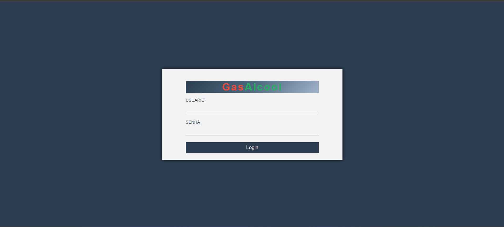
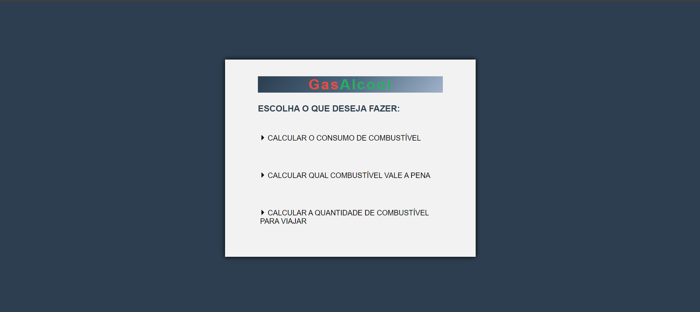
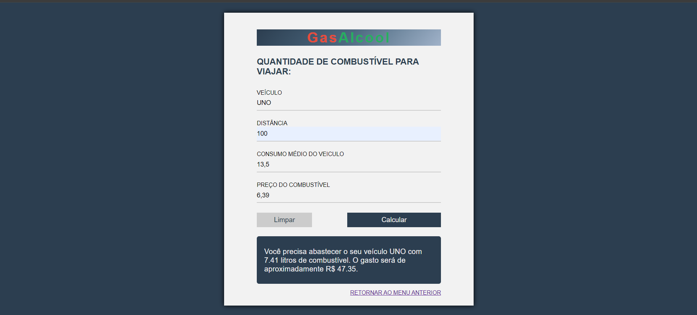
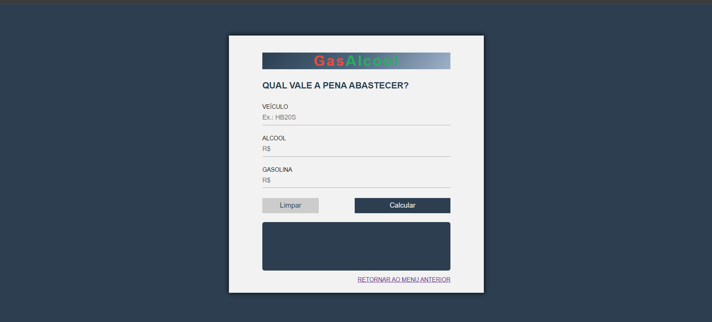
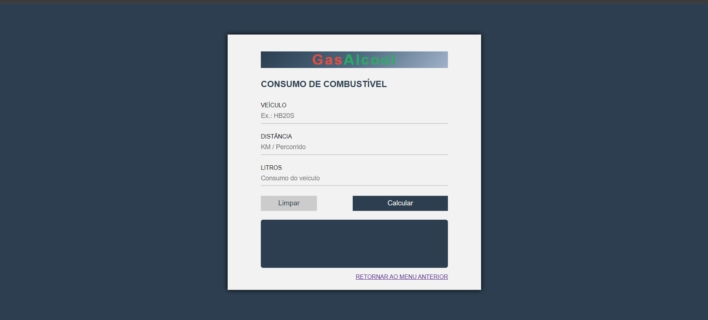

# GasAlcool - Calculadora de combustível

Programa para calcular o consumo de combustivel do veículo, qual combustivel vale a pena abastecer (Gasolina ou Alcool) e quanto o usuário deve abastecer para realizar uma viagem e o valor aproximado do gasto.

## Ferramentas para utilização do código
* Instalação do XAMPP: https://www.apachefriends.org/pt_br/index.html

* Após a instalação do XAMPP, clonar o repositório na pasta "htdocs" para rodar o aplicativo localmente e conseguir ter acesso a calculadora e suas funcionalidades.

## Usuário e senha
* User: admin
* Senha: 123admin

## Telas
Programa em funcionamento: 

## Tecnologias utilizadas:
* HTML5
* CSS3
* JavaScript
* PHP
* Xampp
